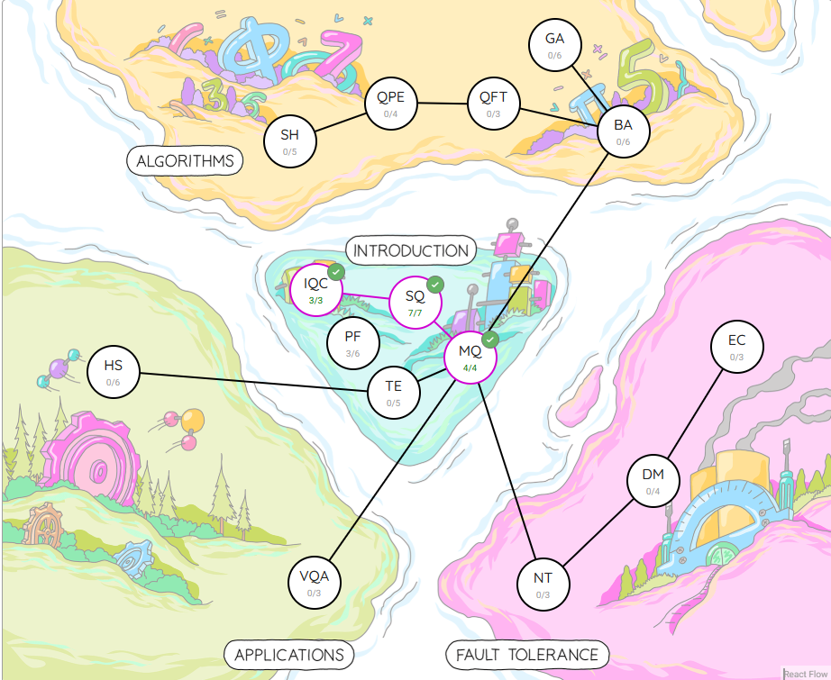

# Learning-Pennylane

A repository dedicated to learning and practicing quantum computing using Xanadu's PennyLane framework.

## Topics Covered

* Codebook Map : PennyLane Fundamentals 3/6
* Codebook Map : Introduction to Quantum Computing 3/3
* Codebook Map : Single-Qubit Gates 7/7
* Codebook Map : Circuits with Many Qubits 4/4
* more...

* ## My Learning Progress

